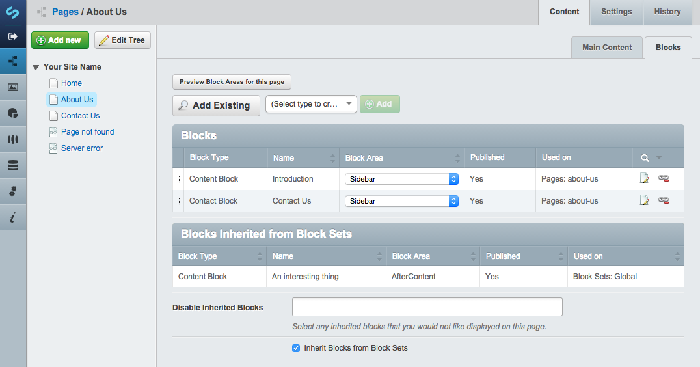
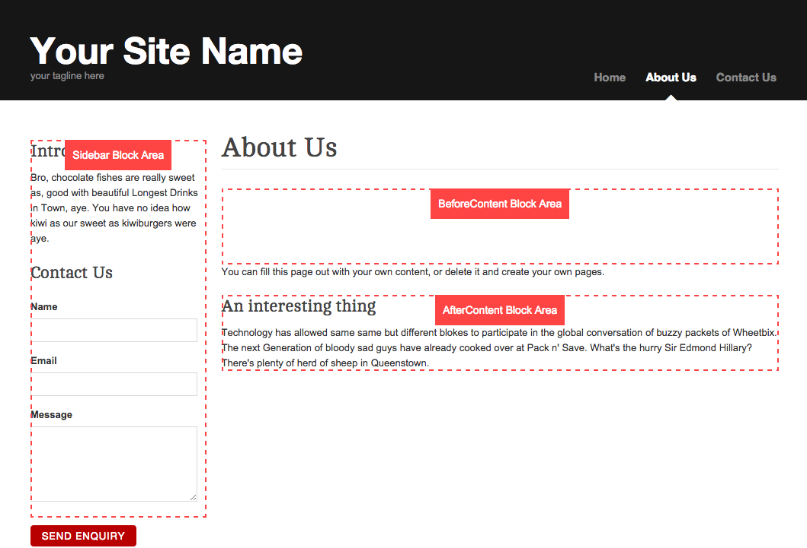
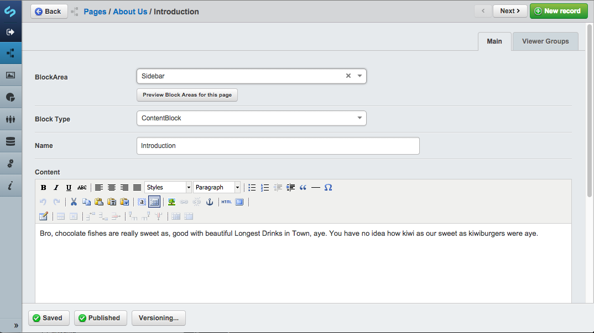
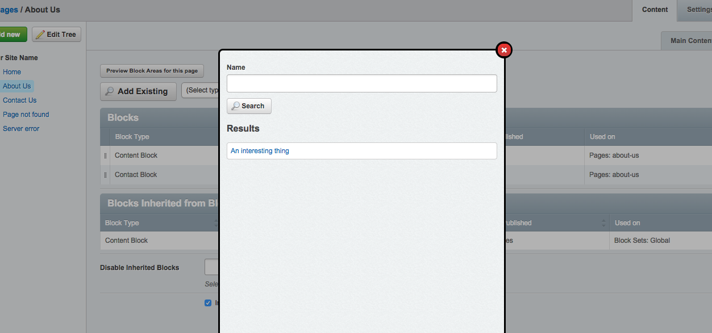

# SilverStripe Blocks

[](https://scrutinizer-ci.com/g/sheadawson/silverstripe-blocks/?branch=master)

The Blocks modules aims to provide developers with a flexible foundation for defining reusable blocks of content or widgets that can be managed in the CMS.

## Features

* Blocks are Versioned
* Blocks with Forms possible (through `Block_Controller`)
* Drag and Drop re-ordering of Blocks
* Duplicate Blocks
* BlockSets for global blocks
* Allow exclusion of any page types from using Blocks
* Allow disabling of default/example block type - ContentBlock
* Allow disabling of specific blocks


## Upgrading from 0.x

See [the upgrade guide](docs/upgrading.md)

## Requirements

* SilverStripe CMS ~3.1
* [GridFieldExtensions](https://github.com/silverstripe-australia/silverstripe-gridfieldextensions)
* [MultivalueField](https://github.com/nyeholt/silverstripe-multivaluefield)
* [GridField BetterButtons](https://github.com/unclecheese/silverstripe-gridfield-betterbuttons)

## Recommended
* [GridField Copybutton](https://github.com/unisolutions/silverstripe-copybutton) (duplication of blocks, from BlockAdmin)

## Installation

```sh
composer require sheadawson/silverstripe-blocks
```

Install via composer, run `dev/build`

## Quickstart

### 1. Define Block Areas and Settings for your theme in `mysite/_config/config.yml`

``` yml
BlockManager:
  themes:
    simple:
      areas:
        Sidebar: true # a Sidebar area will be available on all page types in simple theme
        BeforeContent:
          only: HomePage # a BeforeContent area will be available only on HomePage page types in simple theme
        AfterContent:
          except: HomePage # a AfterContent area will be available on all page types except HomePage in simple theme
        Footer: true # a Footer area will be available on all page types in simple theme

      use_blocksets: false # Whether to use BlockSet functionality (default if undeclared: true)
      use_extra_css_classes: true # Whether to allow cms users to add extra css classes to blocks (default if undeclared: false)
      prefix_default_css_classes: 'myprefix--' # prefix the automatically generated CSSClasses based on class name (default if undeclared: false)
      exclude_from_page_types: # Disable the Blocks tab completely on these pages of these types
        - ContactPage
      #disabled_blocks: #allows you to disable specific blocks
      #  - ContentBlock
  use_default_blocks: false # Disable/enable the default Block types (ContentBlock) (default if undeclared: true)
  block_area_preview: false # Disable block area preview button in CMS (default if undeclared: true)
```

Remember to run `?flush=1` after modifying your `.yml` config to make sure it gets applied.

### 2. Add Block Areas to your themes templates

Adding the `BeforeContent` and `AfterContent` blocks would look something like

```html
<article>
	<h1>$Title</h1>
	$BlockArea(BeforeContent)
	<div class="content">$Content</div>
	$BlockArea(AfterContent)
</article>
```

`$BlockArea(BeforeContent)` will loop over and display all blocks assigned to the `BeforeContent` area on the current page

You can limit a block area to a maximum number of blocks using the second limit parameter

```html
<article>
	$BlockArea(NewsBlocks, 3)
</article>
```

### 3. Add Blocks to a page in the CMS

You will now be able to add Blocks to Pages via the CMS page edit view and in the Blocks model admin. You can also define
"BlockSets" in the Blocks model admin. BlockSets can be used to apply a common collection of blocks to pages that match the criteria you define on the set.

This module ships with a basic `ContentBlock`, but this can be disabled through the `BlockManager::use_default_blocks config.


## Help


### Restrict Blocks to viewer groups or logged in users

When editing a block, you can restrict who can see it in the frontend by selecting "logged in users" or "users from these groups" under the Viewer Groups tab.

### Templates

There are 2 types of templates you should be aware of.

### BlockArea Template

The `BlockArea` template is responsible for looping over and rendering all blocks in that area. You can override this by
creating a copy of the default `BlockArea.ss` and placing it in your theme's `templates/Includes` folder.

It's likely that your block areas may require different templates. You can achieve this by creating a `BlockArea_{AreaName}.ss` template.

### Block Template

Each subclass of Block requires it's own template with the same name as the class. So, `SlideshowBlock.php` would have a
`SlideshowBlock.ss` template. If your block requires different templates depending on the `BlockArea` it's in, you can
create `SlideshowBlock_{AreaName}.ss`

The current page scope can be accessed from Block templates with `$CurrentPage`.

### Block Area Preview

To aid website admins in identifying the areas they can apply blocks to, a "Preview Block Areas for this page" button
is available in the cms. This opens the frontend view of the page in a new tab with `?block_preview=1`.
In Block Preview mode, Block Areas in the template are highlighted and labeled.

There is some markup required in your BlockArea templates to facilitate this: The css class `block-area` and the
`data-areaid='$AreaID'` attribute.

```html
<div class='block-area' data-areaid='$AreaID'>
	<% loop BlockArea %>
		$BlockHTML
	<% end_loop %>
</div>
```

### Form Blocks

As of v1.0 Blocks can now handle forms. See this gist for as an example:

* [Block with Form example](https://gist.github.com/sheadawson/e584b0771f6b124701b4)

### What if I'm not using a theme?

If your running your SS instance "themeless", you can configure your blocks using the imaginary "default" theme.

``` yml
BlockManager:
  themes:
    default:
      areas:
      ...
```

### Remove the Blocks button from the main CMS menu

The BlockAdmin section is not always needed to be used. If you wish, you can remove the button from the menu by inserting this to `mysite/_config.php`:

``` php
CMSMenu::remove_menu_item('BlockAdmin');
```

### Block icons

Until this module properly supports icons, you can define icons by creating a `getTypeForGridfield` method in your block.
Here's an example that uses font awesome:


```php
public function getIcon()
{
    return '<i class="fa fa-thumbs-up fa-3x" title="' . $this->singular_name() . '" aria-hidden="true"></i>';
}
public function getTypeForGridfield()
{
    $icon = $this->getIcon();
    if ($icon) {
        $obj = HTMLText::create();
        $obj->setValue($icon);
        return $obj;
    } else {
        return parent::getTypeForGridfield();
    }
}
```

## Translatable Blocks

For creating Blocks with translatable content, using the [translatble module](https://github.com/silverstripe/silverstripe-translatable), see [this gist](https://gist.github.com/thezenmonkey/6e6730023af553f12e3ab762ace3b08a) for a kick start.

## Screenshots


Overview


Preview of block locations


Edit a block


Add an existing block

## TODO

- [ ] Re-add: Sorting primarily by Area (in order of declaration in config), on Pages (removed in favor of dr'ndr sorting)
- [ ] Add icon/pic to base Block as method of recognition when dealing with lots of different blocks
